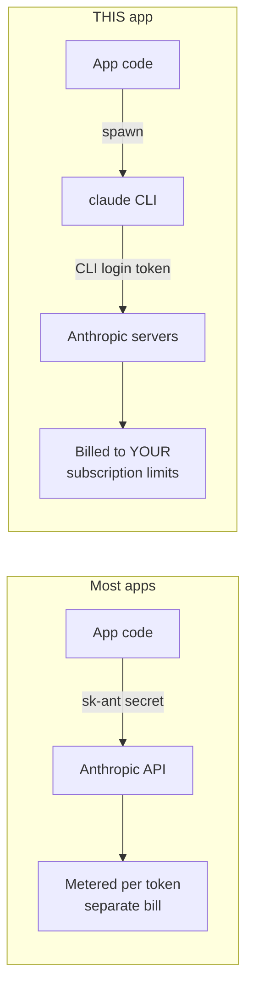
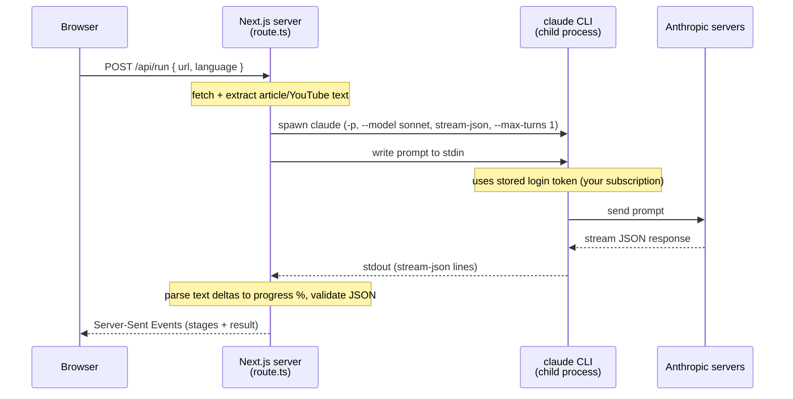
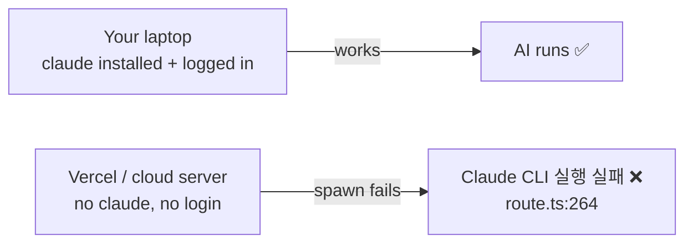

# How This App Uses AI (No API Key)

This app does **not** call an AI API directly. It launches the local **`claude` CLI** (the Claude Code command-line tool) as a child process and pipes data through it. The CLI is already logged in with **your Claude subscription**, so usage bills against your subscription's limits — not a pay-per-token API key.

Key line — [app/api/run/route.ts:205](app/api/run/route.ts#L205):

```js
const child = spawn("claude", args, {
  env: { ...process.env, FORCE_COLOR: "0" },   // inherits YOUR CLI login
});
```

---

## Two ways apps reach Anthropic



| Path | Auth | Who pays |
|------|------|----------|
| API key | `sk-ant-...` secret | metered per token, separate bill |
| `claude` CLI (this app) | your CLI login session | your Claude subscription (Pro/Max) |

---

## Request flow



---

## What `spawn` does

`spawn` = launch another program as a child process. The server runs the `claude` terminal command, pipes the prompt in via **stdin**, reads the answer back from **stdout**.

```mermaid
flowchart TD
    APP[Your app] -->|spawn| CLI["`claude` CLI process"]
    APP -.->|stdin: prompt| CLI
    CLI -.->|stdout: stream-json| APP
    CLI -->|already logged in| ANT[Anthropic servers]
    ANT -->|your subscription| CLI
```

CLI args — [route.ts:194-204](app/api/run/route.ts#L194-L204):

| Arg | Meaning |
|-----|---------|
| `-p` | print mode — one-shot, non-interactive |
| `--model sonnet` | use Claude Sonnet |
| `--output-format stream-json` | emit JSON stream → live progress bar |
| `--verbose` | full event stream |
| `--max-turns 1` | single response, no back-and-forth |

---

## Why no API key in the code

When you ran `claude` and logged in once, the CLI stored an auth token tied to your subscription. Every spawn inherits that login via `env: { ...process.env }` ([route.ts:208](app/api/run/route.ts#L208)) — it borrows the environment of whoever started the server (you, already authenticated).

- **No secret in the repo.** Nothing to leak, nothing to put in `.env`. Auth lives in your CLI session, outside this codebase.
- **Subscription limits apply**, not API quotas.

---

## Catch: only runs where the CLI is installed + logged in



Deploy to a normal host → `spawn("claude")` fails because there's no CLI and no login there. This is a **local-first** design.

---

**Bottom line:** the app piggybacks on the Claude Code CLI you already authenticated. The CLI holds your subscription credentials; the app drives it like a puppet via `spawn`.
