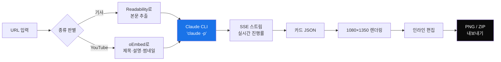

# Instagram 카드 생성기

AI 뉴스 URL을 인스타그램 캐러셀로 변환합니다. 비전문가도 이해할 수 있는 언어로, 정확한 용어는 그대로 살려서, **한국어로**.

> 영어 기사 / 유튜브 영상 → Claude Sonnet 4.6 → 한국어 카드 5~9장 → PNG 내보내기

---

## 처음이라면 — 설치부터 첫 카드까지

코딩이 처음이거나, 이런 프로젝트 처음 다운받아 보신다면 이 섹션을 그대로 따라하세요.

### 준비물 (한 번만)

#### 1. Node.js 설치
[nodejs.org](https://nodejs.org) 접속 → **LTS** 버튼 다운로드 → 설치. 그 외 옵션은 다 기본값으로.

설치 확인 — 터미널(macOS는 Terminal, Windows는 PowerShell)에서:
```
node --version
```
`v20.x.x` 같은 게 뜨면 OK.

#### 2. Git 설치
- **macOS**: 터미널에서 `git --version` 한 번 쳐보세요. 없으면 설치 안내가 자동으로 뜹니다.
- **Windows**: [git-scm.com](https://git-scm.com/) 다운받아 설치. 모두 기본값으로.

#### 3. Claude Code 설치 + 로그인

```
npm install -g @anthropic-ai/claude-code
claude login
```

브라우저가 열리고 Claude 계정으로 로그인. **Claude Pro 또는 Max 구독이 있어야 합니다.** 이 앱은 별도 API 키 없이 본인 구독을 그대로 씁니다.

### 이 프로젝트 받기

```
git clone https://github.com/whatfontisthis/instagram-card.git
cd instagram-card
npm install
```

`npm install`은 처음 한 번만. 2~3분 걸립니다.

### 실행

```
npm run dev
```

`Ready in 1.2s` 같은 줄이 뜨면 성공. 브라우저에서:

**http://localhost:3000**

### 카드 만들기 (5단계)

1. URL 입력란에 기사 또는 유튜브 링크 붙여넣기
2. **생성** 클릭 → 10~20초 대기 (진행 패널에 단계별 상황이 보입니다)
3. 카드가 나오면 텍스트 **클릭 → 직접 수정** 가능
4. 상단 색 동그라미로 그라데이션 변경
5. **PNG** 또는 **전체 ZIP 내보내기**

### 종료

터미널 창에서 **Ctrl + C**. 다음부터는 `npm run dev`만 다시 치면 됩니다.

---

## 어떻게 만들었나

Claude Code의 `/grill-me` 스킬로 설계 결정을 하나씩 좁혀가며 만들었습니다. 큰 갈래부터 작은 갈래까지 7개 질문에 답하면서 스펙을 확정했습니다.

| # | 질문 | 결정 |
|---|---|---|
| 1 | 형태 | 로컬 웹앱 (Next.js + Tailwind) |
| 2 | 영상 처리 | 자막 대신 제목 + 설명 + 썸네일 |
| 3 | 카드 구조 | **커버 1 → 본문 3~7 → 결론 1** |
| 4 | 배경 | 커버=원본 이미지, 본문=그라데이션 5종 |
| 5 | 편집 | DOM 직접 편집 (WYSIWYG) |
| 6 | 타이포 | Pretendard / Roboto, 굵기로 위계 |
| 7 | 모델 | Claude Sonnet 4.6 + 구조화 JSON 출력 |

이후 _"멈추지 말고 다 만들어"_ 명령으로 한 번에 빌드까지 완료. 디자인은 디터 람스 → Material 3(Google) 순으로 갈아끼웠고, 결국 Material 3로 안착.

---

## 작동 방식



핵심 포인트:

- **API 키 없이 동작합니다.** 서버가 `claude -p` 자식 프로세스로 본인 구독 인증을 그대로 사용합니다.
- **카드 화면이 곧 결과물입니다.** DOM을 그대로 PNG로 출력 → 미리보기와 결과가 100% 일치.
- **용어와 풀이가 한 쌍입니다.** 모델이 `key_term`과 `gloss`를 같이 생성. _"Mixture of Experts (질문마다 모델 일부만 활성화되는 구조)"_ 같은 패턴이 자동으로 나옵니다.
- **진행 상황이 실시간으로 보입니다.** 4단계 stepper + Claude 추론 시 1~100% 진행률 바 + 완료 시 confetti.

---

## 폴더 구조

```
app/
├── page.tsx              # 메인 UI (Material 3)
├── layout.tsx            # 한국어 레이아웃
├── globals.css           # Material 3 컬러 토큰
└── api/run/route.ts      # SSE 스트림 엔드포인트 (extract + Claude 호출)
components/
├── Card.tsx              # 커버 / 본문 / 결론 카드
└── Editable.tsx          # contentEditable 래퍼
lib/
├── prompt.ts             # 시스템 프롬프트 + 예시 2개  ← 톤을 바꾸려면 여기
├── gradients.ts          # 그라데이션 5종  ← 색을 바꾸려면 여기
└── types.ts              # 카드 데이터 타입
```

---

## 톤 다듬는 법

`lib/prompt.ts`의 두 가지가 결과 품질의 90%를 결정합니다.

1. **`SYSTEM_PROMPT`** — 글쓰기 규칙과 금지어 목록
2. **`FEW_SHOT_ASSISTANT_1`, `FEW_SHOT_ASSISTANT_2`** — 모범 답안 2개 (한국어 출력)

본인이 직접 쓴 이상적인 카드 2개로 예시를 교체하면 톤이 즉시 그쪽으로 옮겨갑니다. 규칙 100줄보다 예시 1개가 더 강력합니다.

---

## 문제 해결

### `Failed to launch claude CLI`
`claude` 명령이 PATH에 없거나 로그인이 풀린 상태입니다.
```
claude --version    # 버전 떠야 함
claude login        # 안 떴거나 로그인 풀렸으면 다시 로그인
```

### 카드가 영어로 나옴
`lib/prompt.ts`의 `SYSTEM_PROMPT`과 `FEW_SHOT_ASSISTANT_*`가 한국어 버전인지 확인. 영어로 되어있으면 이 repo의 최신 버전으로 덮어쓰세요.

### `EADDRINUSE: 3000`
3000번 포트가 이미 다른 앱에 잡혀있습니다. 다른 포트로:
```
npm run dev -- --port 3001
```

### 카드 텍스트가 카드 밖으로 넘침
1. 가장 빠른 방법: 카드 텍스트를 직접 클릭해서 짧게 수정
2. 자주 발생하면: `components/Card.tsx`에서 `text-[44px]` 같은 값을 `text-[40px]`로 한 단계 낮추기

### Claude 추론 단계에서 멈춤 / 시간 초과
- 인터넷 연결 확인
- `claude login` 다시 (토큰이 만료됐을 수 있음)
- 구독 quota 한도 도달했는지 확인 (Claude.ai 접속해서 일반 사용 가능한지 테스트)

---

## 알려진 한계 (의도적)

- **유튜브 자막은 아직** 사용 안 함 (제목+설명+썸네일만). 대부분 AI 뉴스 채널은 설명만으로 충분합니다.
- 본문이 길면 카드 밖으로 넘칠 수 있음 → 인라인 편집으로 줄이기.
- 폰트 자동 리사이즈 없음 — 일부러. 자동 축소는 거의 항상 안 예쁩니다.
- 사용 인증은 **이 앱이 실행되는 컴퓨터의 Claude 구독**을 씁니다. 동료에게 배포하려면 README의 "팀 배포" 섹션 참고.

---

## 팀 배포 (선택)

이 앱은 기본적으로 로컬 도구입니다. 동료에게 공유하려면 4가지 옵션이 있습니다:

| 시나리오 | 방법 | 누구의 구독 |
|---|---|---|
| 친한 동료 2~5명 | 각자 이 repo clone, 각자 로컬에서 실행 | 각자의 |
| 같은 팀 + Tailscale 사용 | NAS/홈서버에서 실행, Tailscale로 사설망 접속 | 호스트의 (공유) |
| 공식 팀 도구 | Vercel 배포 + 각자 Anthropic API 키 입력 UI | 각자의 API |
| 데모용 | Cloudflare Tunnel + Basic Auth | 호스트의 (공유) |

자세한 설명은 [팀 배포 가이드](#) (TODO) 참고.

---

## 라이선스

MIT. 자유롭게 가져가서 본인 톤으로 다시 만드세요.
